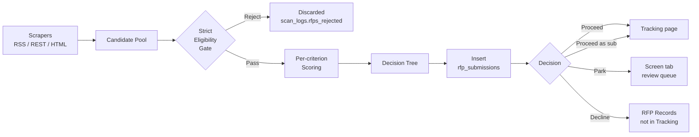
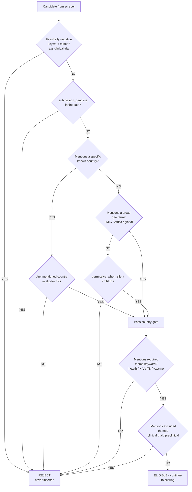
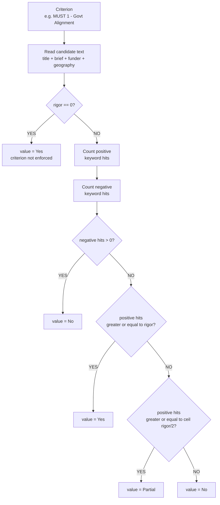
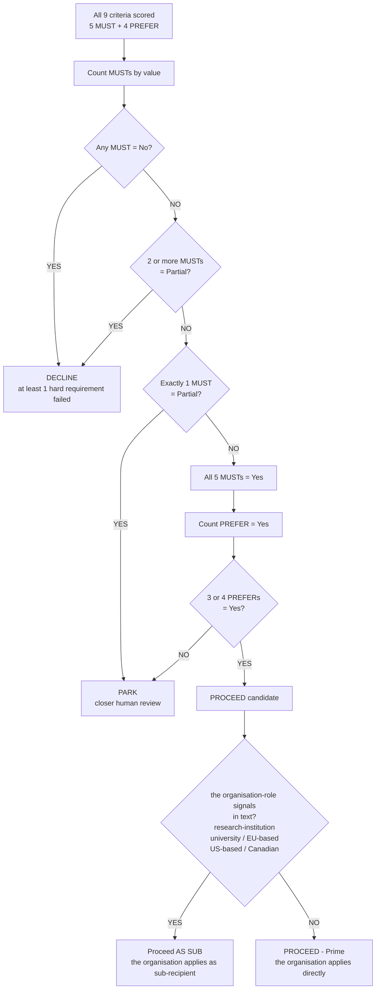
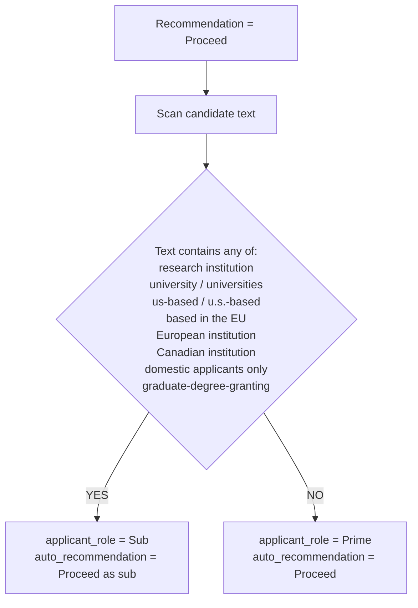

# RFPIS — Scan & Classification Pipeline

This is the core algorithm. Every RFP that lands in the database has been through this pipeline. Every metric you see on the Screen tab, every Proceed row on the Tracking page, every Declined entry — they are all the output of these rules.

> **Reference-deployment caveat:** the decision tree, MUST/PREFER rubric, and role-routing logic described below were specified by the organisation BDT and currently ship hard-coded. They make sense for any global-health implementing org with a US 501(c)(3) parent + country offices, but they're not org-agnostic the way the rest of the scraper is. When RFPIS goes multi-tenant, these rules will move into per-org config. Until then, treat "the organisation" mentions in this document as describing the reference-deployment's policy choices, not a hard constraint of the system.

The pipeline has **two stages**:

1. **Strict Eligibility Gate** (pre-insert filter) — out-of-scope RFPs are dropped before they touch the database. They show up in `scan_logs.rfps_rejected` and never anywhere else.
2. **Auto-Scoring & Decision Tree** (post-insert classification) — the surviving RFPs get scored across 9 MUST/PREFER criteria + feasibility, then the recommendation is set by an explicit decision tree (not score-threshold-based).

Source of truth for the algorithm: [`core/auto_scorer.py`](../core/auto_scorer.py) and [`core/policies.py`](../core/policies.py). Admin-configurable knobs live in **Admin → Settings → Scan eligibility & auto-scoring policies**.

---

## 1. End-to-end pipeline



| Stage | Code | Effect |
|---|---|---|
| Scrape | `core/scraper.py` | Returns candidate dicts |
| Strict Gate | `core/auto_scorer.is_eligible()` | Drops candidate if any check fails |
| Scoring | `core/auto_scorer.auto_score()` | Sets the 9 criteria + score + recommendation + decision + the organisation role |
| Insert | `core/scan_pipeline.py` | Writes row, runs dedup, logs counts |

---

## 2. Strict Eligibility Gate

Applied during the scan, BEFORE inserting. Failing any check drops the candidate. The team never sees these RFPs.



### What each gate means

| Gate | Source policy | Failing examples |
|---|---|---|
| **Feasibility hard-reject** | `criteria.feasibility.negative` | "clinical trial", "high risk" — the organisation doesn't pursue these |
| **Deadline** | `submission_deadline < today` | RFPs that already closed |
| **Country** | `countries.eligible` + `countries.broad_terms` | RFP targets the US only, none of our countries listed |
| **Required theme** | `themes.required_any` | RFP about robotics; no health keyword matches |
| **Excluded theme** | `themes.excluded_any` | RFP title contains "Phase II clinical trial" |

Tune these in **Admin → Settings → Scan eligibility & auto-scoring policies → Countries / Themes / Criteria**.

---

## 3. Per-criterion scoring

For each of the **9 MUST/PREFER criteria + feasibility**, the same routine runs. The criterion gets a value: **Yes / Partial / No**.



### Rigor levels (admin-configurable per criterion)

| Rigor | Behavior | When to use |
|---|---|---|
| 0 | Criterion ignored — always Yes | Optional criterion, no opinion |
| 1 | One positive match = Yes | Lenient |
| 2 | Two positive matches = Yes, one = Partial | **Default for most** |
| 3 | Three positives = Yes, two = Partial | Stricter |
| 4 | Four positives = Yes, two = Partial | Very strict |
| 5 | Five positives = Yes, three = Partial | Maximum scrutiny |

Configure in **Admin → Settings → Criteria → \<criterion expander\> → Rigor slider**.

---

## 4. the organisation Decision Tree (the core rule)

After all 9 criteria have values, the decision is determined by **counts**, not by score:



### Rule cheat-sheet

| MUST counts (No / Partial / Yes) | PREFER (Yes count) | Recommendation |
|---|---|---|
| `1+ / any / any` (any No) | any | **Decline** |
| `0 / 2+ / any` | any | **Decline** |
| `0 / 1 / 4` (one partial) | any | **Park** |
| `0 / 0 / 5` (all yes) | `less than 3` | **Park** |
| `0 / 0 / 5` (all yes) | `3 or 4` | **Proceed** (or "Proceed as sub" if role signals) |

### Why count-based instead of score-based?

the organisation's experience showed that a single "false" on a MUST criterion (e.g. "we cannot meet the eligibility compliance requirement") is a categorical no — no amount of strong PREFER signals should override it. A weighted-sum score would let strong PREFERs partially compensate for a failed MUST, which produces false-positive Proceed recommendations.

The count-based rule eliminates that: any failed MUST is final. Multiple Partials on MUSTs signal too much uncertainty; one Partial is borderline and triggers a Park for human judgement; all Yes + 3 or 4 PREFERs Yes is a clean go.

---

## 5. the organisation Role determination



### Why Sub is a routing signal, not an exclusion

the organisation's organisational structure:

- **the organisation Inc.** is a US-registered 501(c)(3) — the global parent entity.
- **35+ semi-autonomous country offices** (including the organisation Cameroon) operate locally. They can apply for grants directly **OR** route through the organisation US as the lead applicant.

So when an RFP demands a US-based applicant, that's **not** "the organisation can't apply". It's "**the organisation US** takes the lead and the organisation Cameroon becomes sub-recipient". From this Cameroon-facing app's perspective, that lands as `Proceed as sub` — the team knows the work happens but they'll be downstream of HQ on this one.

Same routing applies for other residency requirements:

| Requirement | What it means for the Cameroon team |
|---|---|
| "US-based applicant required" | the organisation US leads → Cameroon is sub |
| "EU / Canada / regional residency required" | Regional NGO partner leads → Cameroon is sub |
| "Research institution required" | Research-org partner leads (the organisation isn't a research institution) → Cameroon is sub |
| "University / academic only" | University partner leads → Cameroon is sub |

In every case the recommendation stays **Proceed** — only the `applicant_role` field flips from `Prime` → `Sub`. The Cameroon team still pursues the opportunity; they just know upfront they're not leading the application.

### Override path

Human reviewers can change `applicant_role` (and `decision`) on the Review tab. Their save replaces the auto-set value. The keyword list `_SUB_ROLE_SIGNALS` in [`core/auto_scorer.py`](../core/auto_scorer.py) is the authoritative source — extend it whenever a new sub-routing pattern appears in incoming RFPs.

---

## 6. The decline_flags field

Separate from the recommendation. Kept for auditability — answers "did the auto-scorer raise concerns?"

```
decline_flags_present =
    NOT (all 5 MUSTs == Yes AND 3 or 4 of PREFERs == Yes)
```

It's **True** for any row that didn't clear the Proceed bar (Park, Decline, or all-MUSTs-Yes-but-fewer-than-3-PREFERs). On the Review tab, this lights up the "Decline flags present?" radio button so the reviewer sees the auto-scorer flagged concerns.

---

## 7. After scoring — what flows where

| Auto-recommendation | `decision` | Visible on |
|---|---|---|
| Proceed | Proceed | **Screen** (Proceed bucket), **Tracking** pipeline, **RFP Records** |
| Proceed as sub | Proceed as sub | Same as above (Sub Opportunities count) |
| Park | Park | **Screen** (Parked bucket), **RFP Records**. NOT on Tracking. |
| Decline | Decline | **Screen** (Declined bucket), **RFP Records**. NOT on Tracking. |

`decision` is auto-set from `auto_recommendation` at insert time. Human edits on the Review tab override both.

---

## 8. Quick reference — where to tune what

| What | Where to edit |
|---|---|
| Eligible countries | Admin → Settings → policies → **Countries** |
| Broad geo terms | Admin → Settings → policies → **Countries** |
| Required theme keywords | Admin → Settings → policies → **Themes** |
| Excluded themes (hard reject) | Admin → Settings → policies → **Themes** |
| Per-criterion rigor (0-5) | Admin → Settings → policies → **Criteria → expand the criterion → Rigor slider** |
| Per-criterion positive keywords | Admin → Settings → policies → **Criteria → expand → Positive keywords** |
| Per-criterion negative keywords | Admin → Settings → policies → **Criteria → expand → Negative keywords** |
| Feasibility negative = hard reject | Admin → Settings → policies → **Criteria → Feasibility → Negative keywords** |
| Decision rule (MUST/PREFER counts) | Hard-coded in `_decision_from_criteria()` — by design (this is the the organisation policy) |
| the organisation-role default | Hard-coded — Prime unless text matches `_SUB_ROLE_SIGNALS` |
| Probability tier thresholds | `config/scoring_weights.yaml` (only affects the gauge colour bands) |

---

## 9. Testing a policy change

Recommended workflow:

1. Admin → Settings → **🔁 Reset for fresh test** (clears scan_logs + auto-scan rows).
2. Adjust policies → **💾 Save policies**.
3. Manual Scan → **▶ Run scan now**.
4. Check the metric strip: Found / New / Rejected. High Rejected vs Found = strict gate is doing the work. High Decline (visible on Screen tab) = MUST/PREFER scoring is biting.
5. Spot-check the Review tab — pick a Park or Decline row, see WHICH criteria fell to Partial/No. That tells you which keyword bag to tweak.
6. Re-run from step 1.

---

## 10. Reading a row's classification

For any auto-scanned RFP on the Review tab, the criterion values + score + decision are all visible. Diagnose any classification by walking the decision tree:

- Is `decision == "Decline"`? Look for a MUST with `value = No`. That's the cause.
- `decision == "Park"`? Count MUSTs = Partial. If 1, that's why. If 0, check the 4 PREFERs.
- `decision == "Proceed"`? Confirm all 5 MUSTs = Yes AND PREFER count Yes is 3 or 4.
- `applicant_role == "Sub"`? Search the brief description for one of the sub-signal phrases (`research institution`, `university`, etc.).

If any classification feels wrong, fix the keyword bag for the offending criterion — don't override the decision repeatedly. Tune once, the policy applies to every future scan.
